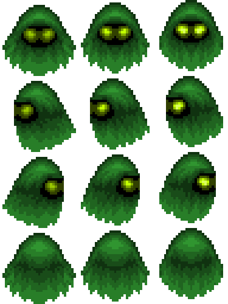

# Farrar Frog Munchers!

Arcade-style number-munching with roaming ghosts. Eat the correct numbers, dodge enemies, clear levels, and climb the high-score table. This was made as a clone of "Number Munchers!", the first computer game I ever played in the computer lab
at Farrar Elementary in Tullahoma on an Apple II.

## How to Play
- Move the hero with the arrow keys.
- Press Space to munch a number if you think it matches the level’s rule (odds/evens/multiples).
- Lose a life if you’re wrong or if an enemy touches you. Three strikes and you’re out.
- Clear all valid numbers to advance to the next level.
- Enemies spawn and roam with different behaviors based on their color and level difficulty.

## Enemies
| Color | Behavior |
| --- | --- |
|  | Walks in and walks back out the way it came. |
|  | Moves straight across the grid in its entry direction. |
|  | Picks random adjacent cells; may leave from the edge. |
|  | Chases the hero, stepping toward you each move. |

Hero:


## High Scores
- After a game ends, you’ll see the Top 10 screen.
- If your score qualifies, you can enter your name; scores are stored in a pickle file at `~/.frog_munchers/high_scores.pkl` (or `FROG_MUNCHERS_STATE_DIR`).

## Running Locally
```bash
python -m venv .venv
source .venv/bin/activate  # Windows: .venv\Scripts\activate
pip install -e .
python main.py
```

## Packaging
- A PyInstaller spec is included (`frog_munchers.spec`). On your target OS, run:
```bash
pyinstaller frog_munchers.spec
```
- The build will appear under `dist/frog_munchers/`; assets are bundled automatically. High scores persist in your home directory.

## Controls
- Arrow keys: move
- Space: munch number
- Shift+Esc: quit immediately
